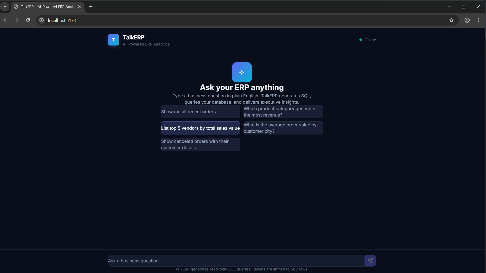
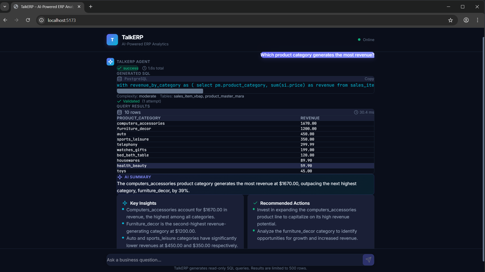
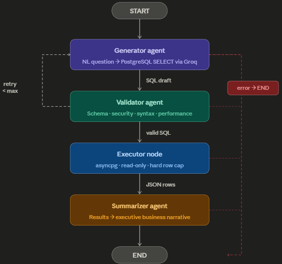

<div align="center">

# 🗣️ TalkERP

### AI-Powered Natural Language Analytics for ERP Data

[](https://python.org)
[](https://fastapi.tiangolo.com)
[](https://react.dev)
[](https://tailwindcss.com)
[](https://langchain-ai.github.io/langgraph/)
[](https://www.postgresql.org)

*Ask business questions in plain English → Get SQL, data, and executive insights in seconds.*

</div>

---

## 📸 Screenshots

### Welcome Screen
<!-- Replace with your actual screenshot -->


### Query Results — Full Pipeline
<!-- Replace with your actual screenshot -->


---

## 🏗️ Architecture

```
┌─────────────────────────────────────────────────────────────────────┐
│                        FRONTEND (React + Vite)                      │
│                                                                     │
│   ┌──────────┐  ┌──────────────┐  ┌──────────┐  ┌──────────────┐  │
│   │  Chat UI  │  │  SQL Display  │  │  Table   │  │  AI Summary  │  │
│   └──────────┘  └──────────────┘  └──────────┘  └──────────────┘  │
│                            │                                        │
│                     POST /api/query                                 │
└────────────────────────────┼────────────────────────────────────────┘
                             │
                             ▼
┌─────────────────────────────────────────────────────────────────────┐
│                      BACKEND (FastAPI + LangGraph)                  │
│                                                                     │
│   ┌─────────────────────────────────────────────────────────────┐   │
│   │                   LangGraph Multi-Agent Pipeline             │   │
│   │                                                             │   │
│   │   START                                                     │   │
│   │     │                                                       │   │
│   │     ▼                                                       │   │
│   │   ┌──────────────┐                                          │   │
│   │   │  Generator   │── error ──────────────────────► END      │   │
│   │   │  (Groq LLM)  │                                          │   │
│   │   └──────┬───────┘                                          │   │
│   │          │                                                   │   │
│   │          ▼                                                   │   │
│   │   ┌──────────────┐    valid    ┌──────────────┐             │   │
│   │   │  Validator   │────────────►│   Executor   │             │   │
│   │   │  (Groq LLM)  │             │  (asyncpg)   │             │   │
│   │   └──────┬───────┘             └──────┬───────┘             │   │
│   │          │                            │                      │   │
│   │     invalid +                         ▼                      │   │
│   │     retries left          ┌──────────────┐                  │   │
│   │          │                │  Summarizer  │                   │   │
│   │          ▼                │  (Groq LLM)  │                   │   │
│   │   ┌──────────────┐       └──────┬───────┘                   │   │
│   │   │  Generator   │              │                            │   │
│   │   │  (retry)     │              ▼                            │   │
│   │   └──────────────┘            END                           │   │
│   │                                                             │   │
│   └─────────────────────────────────────────────────────────────┘   │
│                                                                     │
│   ┌───────────────┐  ┌───────────────┐  ┌───────────────────────┐  │
│   │  Safety Guard  │  │  SQL Executor  │  │  Connection Pool      │  │
│   │  (DML/DDL ban) │  │  (READ ONLY)   │  │  (asyncpg, 2-10)     │  │
│   └───────────────┘  └───────────────┘  └───────────────────────┘  │
│                                                                     │
└──────────────────────────────┬──────────────────────────────────────┘
                               │
                               ▼
┌─────────────────────────────────────────────────────────────────────┐
│                    PostgreSQL 16 (Docker)                            │
│                                                                     │
│   ┌──────────────────┐  ┌──────────────────┐  ┌────────────────┐   │
│   │ customer_master   │  │ sales_header      │  │ product_master │   │
│   │ _kna1             │  │ _vbak             │  │ _mara          │   │
│   └──────────────────┘  └──────────────────┘  └────────────────┘   │
│   ┌──────────────────┐  ┌──────────────────┐                       │
│   │ vendor_master     │  │ sales_item        │                       │
│   │ _lfa1             │  │ _vbap             │                       │
│   └──────────────────┘  └──────────────────┘                       │
└─────────────────────────────────────────────────────────────────────┘
```

### Architecture Diagram
<!-- Replace with your actual architecture diagram if you create one -->


---

## ✨ Features

| Feature | Description |
|---|---|
| 🗣️ **Natural Language Queries** | Ask business questions in plain English |
| 🤖 **Multi-Agent Pipeline** | LangGraph orchestrates 4 specialized AI agents |
| 🛡️ **Dual Safety Layer** | Validator agent + server-side SQL guard blocks all DML/DDL |
| 📊 **Interactive Data Tables** | Sortable results with row counts and execution times |
| 💡 **AI Business Summaries** | Executive-ready insights with recommended actions |
| 🔄 **Auto-Retry Logic** | Validator feeds corrections back to the Generator (up to 2 retries) |
| 🏎️ **Sub-Second Execution** | asyncpg connection pool with read-only transactions |
| 🎨 **Premium Dark UI** | Glassmorphism, gradients, and micro-animations |
| 📋 **One-Click SQL Copy** | Copy generated queries to clipboard |
| 🔒 **Read-Only Queries** | `SET TRANSACTION READ ONLY` enforced at the database level |

---

## 🛠️ Tech Stack

| Layer | Technology |
|---|---|
| **Frontend** | React 19, Vite 8, TailwindCSS v4 |
| **Backend** | FastAPI, Python 3.10+ |
| **Orchestration** | LangGraph (multi-agent state graph) |
| **LLM** | Groq API (Llama 3.3 70B) |
| **Database** | PostgreSQL 16 (Docker) |
| **DB Driver** | asyncpg (async connection pool) |
| **HTTP Client** | httpx (async Groq API calls) |

---

## 📁 Project Structure

```
TalkERP/
├── docker-compose.yml              # PostgreSQL container
├── .gitignore
├── README.md
│
├── backend/
│   ├── .env.example                # Template (safe to commit)
│   ├── .env                        # Your secrets (git-ignored)
│   ├── requirements.txt
│   ├── pytest.ini
│   │
│   ├── config.py                   # pydantic-settings configuration
│   ├── models.py                   # TypedDict state + Pydantic API models
│   ├── prompts.py                  # LLM prompt templates + schema
│   ├── groq_client.py              # Async Groq API wrapper
│   ├── database.py                 # asyncpg pool + safety guards
│   ├── agents.py                   # LangGraph: 4 nodes + routing
│   ├── main.py                     # FastAPI app (3 routes)
│   ├── seed.sql                    # Database seed data
│   │
│   └── tests/
│       └── test_talkerp.py         # Unit tests (mocked LLM)
│
├── frontend/
│   ├── index.html
│   ├── vite.config.js              # TailwindCSS v4 + API proxy
│   ├── package.json
│   │
│   └── src/
│       ├── main.jsx
│       ├── index.css               # Design system + animations
│       └── App.jsx                 # Chat UI (all components)
│
└── screenshots/                    # README images (you add these)
    ├── welcome.png
    ├── query_results.png
    ├── ai_summary.png
    ├── error_handling.png
    └── architecture.png
```

---

## 🚀 Getting Started

### Prerequisites

- **Node.js** 18+ and **npm**
- **Python** 3.10+
- **Docker** (for PostgreSQL)
- **Groq API Key** — [Get one free](https://console.groq.com/keys)

### 1. Clone the Repository

```bash
git clone https://github.com/YOUR_USERNAME/TalkERP.git
cd TalkERP
```

### 2. Start PostgreSQL

```bash
docker compose up -d
```

This spins up PostgreSQL 16 on **port 5433** and auto-seeds the database with sample ERP data (10 customers, 10 vendors, 10 products, 10 orders, 11 line items).

### 3. Set Up the Backend

```bash
cd backend

# Create your .env from the template
cp .env.example .env

# ⚠️ Paste your Groq API key into .env
# GROQ_API_KEY=gsk_your_actual_key_here

# Install Python dependencies
pip install -r requirements.txt

# Start the backend server
python -m uvicorn main:app --host 0.0.0.0 --port 8000 --reload
```

### 4. Set Up the Frontend

```bash
cd frontend

# Install dependencies
npm install

# Start the dev server
npm run dev
```

### 5. Open TalkERP

Navigate to **http://localhost:5173** and start asking questions!

---

## 🔌 API Endpoints

| Method | Endpoint | Description |
|---|---|---|
| `GET` | `/health` | Liveness probe — returns DB and Groq connection status |
| `POST` | `/api/query` | Run the full NL → SQL → Execute → Summarize pipeline |
| `GET` | `/api/schema` | Return the permitted database schema |

### Example Request

```bash
curl -X POST http://localhost:8000/api/query \
  -H "Content-Type: application/json" \
  -d '{"question": "Show me all recent orders", "max_rows": 500}'
```

### Example Response

```json
{
  "question": "Show me all recent orders",
  "status": "success",
  "generator": {
    "sql": "SELECT order_id, customer_id, order_date, order_status FROM sales_header_vbak ORDER BY order_date DESC LIMIT 500",
    "complexity": "simple",
    "tables_referenced": ["sales_header_vbak"]
  },
  "validator": {
    "is_valid": true,
    "issues": [],
    "validation_attempts": 1
  },
  "execution": {
    "rows": [...],
    "row_count": 10,
    "columns": ["order_id", "customer_id", "order_date", "order_status"],
    "execution_time_ms": 19.7
  },
  "summarizer": {
    "summary": "The most recent order was placed on May 1, 2026...",
    "key_insights": ["7 orders delivered", "1 still processing", "1 canceled"],
    "recommended_actions": ["Review processing order O1008", "Analyze canceled order O1005"]
  },
  "total_duration_ms": 1742.3
}
```

---

## 🧪 Running Tests

```bash
cd backend
pytest tests/ -v
```

Tests cover:
- Prompt sanity checks (schema references, security rules)
- Generator node (happy path + Groq error handling)
- Validator node (valid SQL + empty SQL)
- Database safety guard (blocks DELETE, DROP, stacked queries)
- Routing logic (all conditional edges)
- API routes (health, query validation, schema)
- JSON extraction (bare, fenced, prose-wrapped)

---

## 🔒 Security

TalkERP implements **dual-layer security** to prevent destructive operations:

### Layer 1: Validator Agent (LLM)
- Audits every generated SQL query for DML/DDL statements
- Checks for SQL injection patterns (stacked queries, UNION attacks, pg_* access)
- Verifies schema compliance (only permitted tables and columns)

### Layer 2: Server-Side Guard (Code)
- Rejects any query starting with `INSERT`, `UPDATE`, `DELETE`, `DROP`, `ALTER`, etc.
- Blocks stacked queries (`;` in the middle of a statement)
- Forces `SET TRANSACTION READ ONLY` on every database connection
- Connection pool configured with `default_transaction_read_only = on`

---

## 📊 Database Schema

TalkERP uses a simplified SAP-style ERP schema:

| Table | SAP Equivalent | Description |
|---|---|---|
| `customer_master_kna1` | KNA1 | Customer master data |
| `vendor_master_lfa1` | LFA1 | Vendor/seller master data |
| `product_master_mara` | MARA | Product/material master |
| `sales_header_vbak` | VBAK | Sales order headers |
| `sales_item_vbap` | VBAP | Sales order line items |

---

## 🤝 Contributing

1. Fork the repo
2. Create a feature branch (`git checkout -b feature/amazing-feature`)
3. Commit your changes (`git commit -m 'Add amazing feature'`)
4. Push to the branch (`git push origin feature/amazing-feature`)
5. Open a Pull Request

---

## 📄 License

This project is open source and available under the [MIT License](LICENSE).

---

<div align="center">

**Built with ❤️ using LangGraph, FastAPI, React, and Groq**

</div>
